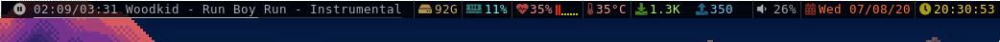

# dwmblocks

This is Randoragon's build of dwmblocks, a modular status bar for dwm written in c.
See the original repo at [github.com/torrinfail/dwmblocks](https://github.com/torrinfail/dwmblocks).

## Modules

Since some modules need a lot of shell trickery to work, it's easier to write entire dedicated scripts,
add them to PATH and have dwmblocks run clean, short commands. For simplicity's sake I don't maintain
those scripts directly in this repo, instead they can be found in my
[dotfiles repository](https://github.com/Randoragon/dotfiles/tree/master/scripts/.scripts/dwmblocks).

Currently the modules are (in order from left):

- pacman updates count
- newsboat unread RSS feeds
- [MPD playback status](https://github.com/randoragon/randoutils/tree/master/dwmbmpd)
- remaining storage space
- RAM usage
- [CPU load](https://github.com/randoragon/randoutils/tree/master/dwmbcpul)
- CPU/GPU Temperature
- network traffic (bytes sent & received per sec)
- PulseAudio volume
- date
- time
- battery power

## dwm integration

**NOTE:** I'm using my own implementation of dwm status bar. Vanilla dwm uses the WM\_NAME X property,
my version uses shared memory and fake signals. Read about more details [here](https://github.com/Randoragon/dwm#status-bar-rewrite).

## Persistent modules

My build of dwm adds "showStatus" next to "showBar". This allows to toggle on and off certain modules of dwmblocks without hiding the
entire bar, which is a nice feature on lower-end machines or in case some module scripts are heavy. The modules that have a persistency
value of 1 will always be visible if the bar is shown, whilst the ones that have persistency value of 0 will only be visible when
the bar AND the status are shown.

## Icons

I use [FontAwesome](https://fontawesome.com/) as my source for icons. This of course means that
dwm has to be compiled with fontawesome available as a fallback font. Check [my dwm repo](https://github.com/Randoragon/dwm)
for any clarifications.

## Installation

Arch Linux users can install the `dwmblocks-randoragon-git` AUR package.

Otherwise, simply run the following command (if necessary, as root):

    make install
