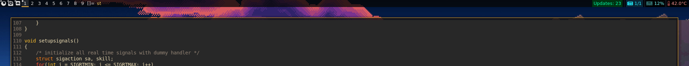

# dwmblocks

This is Randoragon's build of dwmblocks, a modular status bar for dwm written in c.
See the original repo at [github.com/torrinfail/dwmblocks](https://github.com/torrinfail/dwmblocks).

## Modules

Since some modules need a lot of shell trickery to work, it's easier to write entire dedicated scripts,
add them to PATH and have dwmblocks run clean, short commands. For simplicity's sake I don't maintain
those scripts directly in this repo, instead they can all be found in my [dotfiles repo](https://github.com/randoragon/dotfiles).

Currently the modules are:

- pacman updates count
- newsboat unread RSS feeds
- RAM usage
- CPU Temperature

## dwm integration

dwmblocks can receive signals from dwm which carry information about which block was clicked
and with which mouse button. [This page](https://dwm.suckless.org/patches/statuscmd/) both
explains and supplies patches for everything you need to set this up yourself.

**NOTE:** I'm using my own implementation of dwm status bar. Vanilla dwm uses the WM\_NAME X property,
my version uses shared memory and fake signals. Read about more details [here](https://github.com/Randoragon/dwm#status-bar-rewrite).
